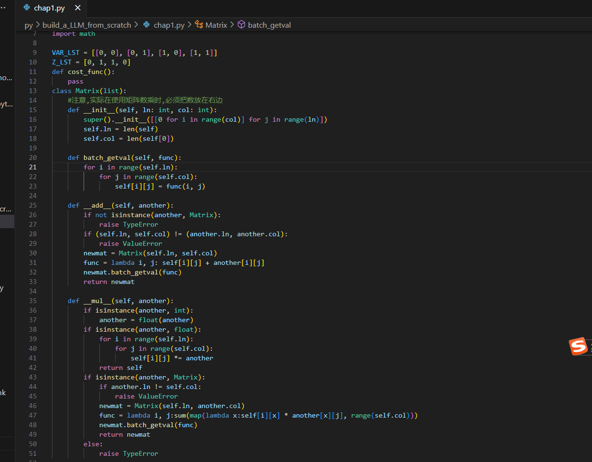

# 2025Spring_DSA_B
2025春数算（B）（yhf班）课程资料
## 课程评估
首先感谢闫老师的辛苦付出，一学期下来整了好几百页pdf还贴心的根据同学们不理解的地方细化和更新。
### 个人心态：
期末考5/6，止步在神经网络，虽有遗憾，但并不后悔，因为其实本人选课时申请+投80点押这个班本来就不是冲着给分去的（如果是，我宁愿选那种机考A+B难度的班级），开始时的心态就是奔着一种把东西“自己想出来、手搓出来”的兴趣和成就感来选的课，最后这门课的绝佳体验感也让自己不失所望。后来在老师班上听着关于大模型的补充内容，看着群里面大佬开发教学网客户端和todolist应用程序，本人受益匪浅，不但了解了一些该领域的基本知识，更产生了一种责任感和紧迫感，觉得需要把自己从前单纯觉得“有意思”的事付诸实际应用，也即“有意义”，此后在第6-7周也曾尝试着写过一些简单的与AI有关的程序以了解基本原理，可惜由于课业紧张没有坚持下来。可能暑假有空了就找一些诸如笔画输入法、LLM、电路仿真的课题学习和尝试开发吧（至于是否成功不能保证）...希望学校能多开一些这样能够让同学们找到兴趣、同时也联系实际转化为志趣的课程，（有人提到很多人追求给分，虽然在现阶段完全取消绩点并不现实，但是建议学校可以考虑改等级制，例如达到一个特定的标准就可满绩等）
### 课程的具体评价：
从内容上看，课程（按照pdf）知识密度大，讲解透彻，适合自学；本学期新增加的大模型相关科普内容是一次很有意义的尝试；希望之后能将这种科普内容和主干课程联系的更紧密一些，对同学们理解自己学习的基础算法有哪些实际应用更有帮助；
从节奏上看，由于很多知识点在闫老师上学期的计概课程里面有讲过，又听说xk教务不允许提前下课，所以课程进度稍微有点慢，建议之后可以通过增加大模型科普内容的方式优化；
从考试上看，符合班上大部分人的水平，助教能够对有争议的题目给出合理的评价（不过我没有去找分，因为我在考试时发现了写的第一版程序是错的，之后第二版没改完）
### 实用建议：
平时学习：
0.选课之后自查一下基础语法、oop和递归的掌握情况，这是在本课程中一直会贯穿的语法和思想；
1.老师说是模版的算法能用类写用类写，不能用类写就用函数写，之后平时做练习的时候遇到重复的模板CtrlC+V比每次都重复敲一遍现实；并且之后遇到实际工程的时候就不要重复造轮子了；
2.遇到oj上自己被卡住的题，过了2-3天后就不要死磕了，因为oj不够规范，很多输入输出是给c++设计的，没考虑周全；
3.在自己有思考的同时，多问老师、群里同学和AI，毕竟以后实际工作的时候是有人合作且可以求助外部工具的；（但是不要在ollama里面找7B模型，一般很烂）
考试：
1.关于机房vscode的使用:写Python没有pep8习惯的人建议拿到机房的vscode就去扩展那一栏找到所有名字带数字8(如autopep8,flake8等)的扩展全部禁用，否则一堆的报错很搞人心态；
2.期末机考前一周一定要抽出时间去机房熟悉一下机械键盘的手感（特别是像我这种重度依赖笔记本的用户）否则考试的时候会比较难受。

最后放上一张图，这是我4月份的时候忙里偷闲开始立flag学习神经网络的一些程序，暑假加油！

最后再次感谢闫老师半个学期的陪伴！
